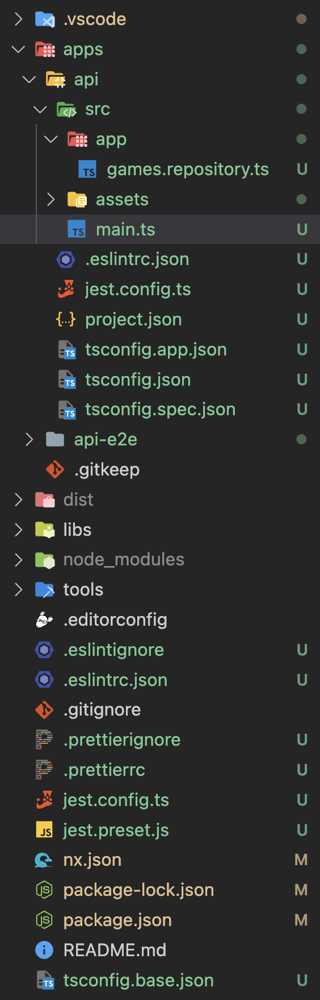

# 💻 Lab 2 - Generate a Node API

###### ⏰ Estimated time: 15-20 minutes

 

In this lab we'll generate a Node API within the new monorepo.
  

## 📚 Learning outcomes:

- **Get familiar with generating new apps within your workspace using the Nx CLI**
     

## 📲 After this workshop, your app should look similar to this:

  
App Screenshot

  

  
File structure

  

 

## 🏋️‍♀️ Steps:

1. Make sure you can run Nx commands:
   - try out `nx --version` and see if it outputs a version number
   - install the CLI globally: `npm i -g nx`
   - if you don't want to install it globally, use `npx nx` instead of `nx` in all the commands below

> Please make sure you are using the latest version of Nx (15.8+)

    

2. **Run `nx list`** to see which plugins you have installed and which are available
      

3. **Add the Node plugin: `@nrwl/node`**
      

4. Let's also **add Express**: `express`
      
5. **Use the [`@nrwl/node` plugin](https://nx.dev/packages/node/generators/application) to generate a Node app** called `api` in your new workspace

   ⚠️**Important:** Make sure you choose **express** as the framework when asked!
    

6. **Create a new `games.repository.ts` file in the folder `apps/api/src/app`** in your app, it returns an array of some games (you can copy the code from [here](../../examples/lab2/apps/api/src/app/games.repository.ts))

   ⏳**Reminder:** When you are given example files to copy, the folder they're in hints to the _folder_ and _filename_ you can place them in when you do the copying.
      

7. **Update the main.ts file** to include some new endpoints (do not spend too much time on this, you can copy it from here [main.ts](../../examples/lab2/apps/api/src/main.ts) - and replace the full contents of the file)
        

8. **Serve the app**: `nx serve api`
      

9. **See your games endpoint** live at [http://localhost:4200/](http://localhost:4200/api/games)
   

10. **Inspect what changed** from the last time you committed, then **commit your changes**
       

---

🎓If you get stuck, check out [the solution](SOLUTION.md)

---

[➡️ Next lab ➡️](../lab3/LAB.md)
